# MP4 homework: the answer keys and what SAM 3 does with them

Generated by `build/answer_key_report.py` from `data/sheets/homework/*.key.json` with the live model; every number here is
reproducible from the keys. Boxes are the key's own boxes moved by a few percent, like a student's; counts come from one
example box (the key's first one) through `segment_like`; phrases are scored by `lab.ask`. The raw feasibility runs that
chose these sheets live in `_candidates/sam3_eval/` (not in the repository); the guide's section 2 holds the same numbers in prose.

## Overview

| sheet | discipline | areas (measured) | counts from one example (found / on the sheet, extras) | phrases that work |
|---|---|---|---|---|
| usda_5542 | floor plan | room n=10, median 6.8 %, worst 31 % | - | *room*: 10/14 found, 0 extra; *bedroom*: 6/14 found, 0 extra; *curved line*: 1/14 found, 30 extra |
| va_floor | floor plan + plumbing | room n=13, median 2.4 %, worst 9 % | - | *room*: 10/13 found, 3 extra |
| va_ceiling | electrical | - | 2x4 light fixture 39/41 (+0); 2x2 light fixture 8/8 (+1); recessed light 14/14 (+0) | *rectangle*: 7/41 found, 24 extra |
| test_fp | structural | footing n=10, median 10.7 %, worst 16 % | footing 10/10 (+4) | *square*: 10/10 found, 5 extra; *rectangle*: 10/10 found, 9 extra |
| test_fp_2 | structural | footing n=19, median 1.0 %, worst 23 %; pit n=1, median 3.9 %, worst 4 % | footing 19/19 (+1) | *square*: 19/19 found, 23 extra; *rectangle*: 19/19 found, 6 extra |
| uscg_motorpool | structural | footing n=20, median 4.5 %, worst 30 %; pit n=2, median 82.2 %, worst 104 % | footing 19/20 (+5); grid bubble 32/32 (+2) | *square*: 9/20 found, 10 extra; *rectangle*: 7/20 found, 4 extra; *circle*: 32/32 found, 6 extra |
| uscg_pile | structural | - | pile footing 29/29 (+2) | *rectangle*: 29/29 found, 8 extra |

## usda_5542 - Five-room farmhouse, 32 ft x 29 ft (USDA design 710-5542)

*floor plan.* USDA design 710-5542, 'Five-room farmhouse', Miscellaneous Publication 360 'Plans of Farm Buildings for Southern States' (1940), p. 15. U.S. Department of Agriculture, Bureau of Agricultural Engineering, Public domain (work of the U.S. Government, 17 U.S.C. 105). https://archive.org/details/plansoffarmbuild360unit

**The answer key drawn on the sheet** (areas filled with their true sq ft, scale references in blue, every counted symbol in purple):

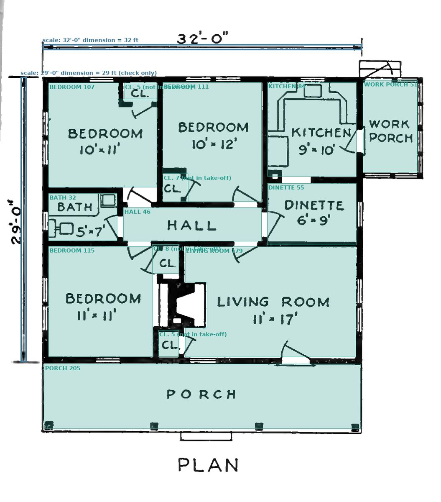

### Answer key

Scale: 26.80 px/ft. the 32'-0" overall dimension across the top measures 857.5 px, so 26.80 px per ft; the 29'-0" dimension down the left side measures 765 px, so 26.38 px per ft. The two disagree by 1.6 %. Every area in this key is computed with 26.80 px per ft.

| scale reference | feet | px in the key | px/ft | used for the take-off | note |
|---|---|---|---|---|---|
| 32'-0" dimension | 32 | 858 | 26.81 | yes | box it from the tip of the left arrowhead to the tip of the right one |
| 29'-0" dimension | 29 | 766 | 26.41 | check only | 765 px / 29 ft = 26.38 px per ft, 1.6 % less than the 32'-0" line; areas here use the 32'-0" line |

| # | label | type | category | printed size | true sq ft | in the take-off | note |
|---|---|---|---|---|---|---|---|
| 1 | BEDROOM | bedroom | room | 10' x 11' | 107.2 | yes | drawn 10.9 ft x 10.4 ft with the closet cut out of the corner; the sizes printed on this sheet do not agree with the dra |
| 2 | BEDROOM | bedroom | room | 10' x 12' | 111.0 | yes | drawn 9.9 ft x 11.9 ft with the closet cut out of the corner; the sizes printed on this sheet do not agree with the draw |
| 3 | KITCHEN | kitchen | room | 9' x 10' | 84.2 | yes | drawn 8.9 ft x 9.4 ft, about 6 % under the printed 9' x 10'; the sizes printed on this sheet do not agree with the drawi |
| 4 | BATH | bathroom | room | 5' x 7' | 32.5 | yes | drawn 6.9 ft x 4.7 ft: the printed 5' x 7' has the two sides the wrong way round and is about 7 % larger than the drawin |
| 5 | DINETTE | dining room | room | 6' x 9' | 54.9 | yes |  |
| 6 | HALL | hall | room | None | 46.5 | yes |  |
| 7 | BEDROOM | bedroom | room | 11' x 11' | 115.4 | yes | drawn 10.4 ft x 11.0 ft: this bedroom sits in the same column as the 10' x 11' bedroom above it, so the two printed widt |
| 8 | LIVING ROOM | living room | room | 11' x 17' | 179.1 | yes | the fireplace and its hearth stand in the west wall and take about 10 sq ft out of the floor; the sizes printed on this  |
| 9 | WORK PORCH | porch | room | None | 50.6 | yes | no printed size |
| 10 | PORCH | porch | room | None | 204.8 | yes | no printed size; runs the full width of the house |
| 11 | CL. | closet | room | None | 5.3 | no |  |
| 12 | CL. | closet | room | None | 7.1 | no |  |
| 13 | CL. | closet | room | None | 7.7 | no |  |
| 14 | CL. | closet | room | None | 5.4 | no |  |

- 10 rooms in the take-off, 986 sq ft together (731 sq ft indoors).

Tasks in the key:

1. Set the scale: box the 32'-0" dimension at the top from arrowhead tip to arrowhead tip (label: scale: 32'-0" dimension).
2. Box the 29'-0" dimension down the left side as well (label: scale: 29'-0" dimension) and compare the two readings.
3. Box every room, porch and hall (label: room).
4. Careful: the sizes printed on this sheet do not agree with the drawing. The bedroom lettered 10' x 11' and the one lettered 11' x 11' are drawn in the same 10.4 ft wide column, and the BATH is lettered 5' x 7' but drawn 6.9 ft x 4.7 ft. The answer key is the area you measure off the drawing, not the lettered size; say in your report which rooms disagree and by how much.

### What SAM 3 measures (boxes taken from the key, each side moved by a few percent)

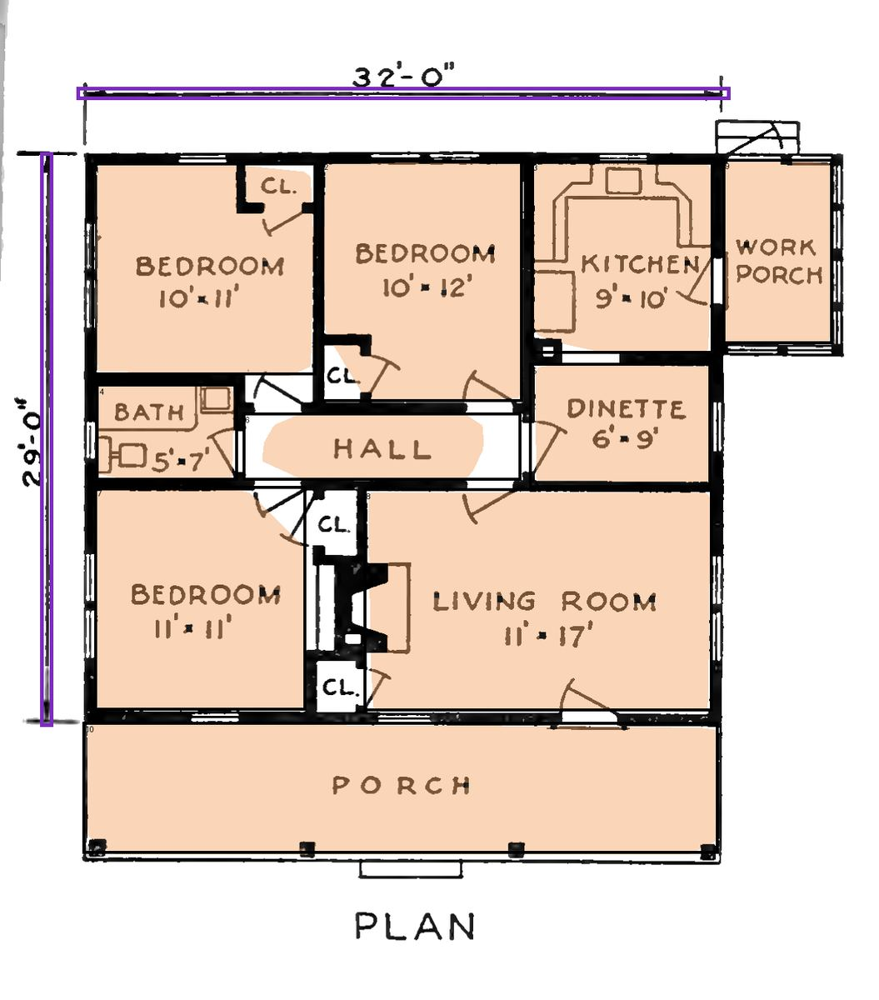

| scale box | px | px/ft | vs the key |
|---|---|---|---|
| 32'-0" dimension | 881 | 27.53 | +2.7 % |
| 29'-0" dimension | 773 | 26.67 | +1.0 % |
Scale used: 27.53 px/ft.

| # | room (key) | measured sq ft | true sq ft | error | note |
|---|---|---|---|---|---|
| 1 | BEDROOM | 104.7 | 107 | -2 % |  |
| 2 | BEDROOM | 106.8 | 111 | -4 % |  |
| 3 | KITCHEN | 78.1 | 84 | -7 % |  |
| 4 | BATH | 30.4 | 32 | -6 % |  |
| 5 | DINETTE | 48.5 | 55 | -12 % |  |
| 6 | HALL | 32.1 | 46 | -31 % |  |
| 7 | BEDROOM | 105.9 | 115 | -8 % |  |
| 8 | LIVING ROOM | 175.7 | 179 | -2 % |  |
| 9 | WORK PORCH | 46.7 | 51 | -8 % |  |
| 10 | PORCH | 192.5 | 205 | -6 % |  |
10 rooms: median error 6.8 %, worst 31 %.

### What phrases find (the phrase cells 2b, 3b and 4b, confidence 0.3)

| phrase | regions | scored against (the key category the regions match best) | result |
|---|---|---|---|
| room | 10 | room | 10/14 found, 0 extra; areas median 3 %, worst 45 % |
| bedroom | 5 | room | 6/14 found, 0 extra; areas median 4 %, worst 119 % |
| door | 0 | room | 0/14 found, 0 extra |
| window | 0 | room | 0/14 found, 0 extra |
| curved line | 31 | room | 1/14 found, 30 extra; areas median 96 %, worst 96 % |

## va_floor - VA outpatient clinic, lease module: floor plan (rooms and plumbing fixtures)

*floor plan + plumbing.* Outpatient / PACT Clinic, lease module (CBOC-L.pdf), VA Technical Information Library room templates. US Department of Veterans Affairs, Office of Construction & Facilities Management (2018), Public domain (work of the US federal government). https://www.cfm.va.gov/til/rTemplate/documents/CBOC-L.pdf

**The answer key drawn on the sheet** (areas filled with their true sq ft, scale references in blue, every counted symbol in purple):

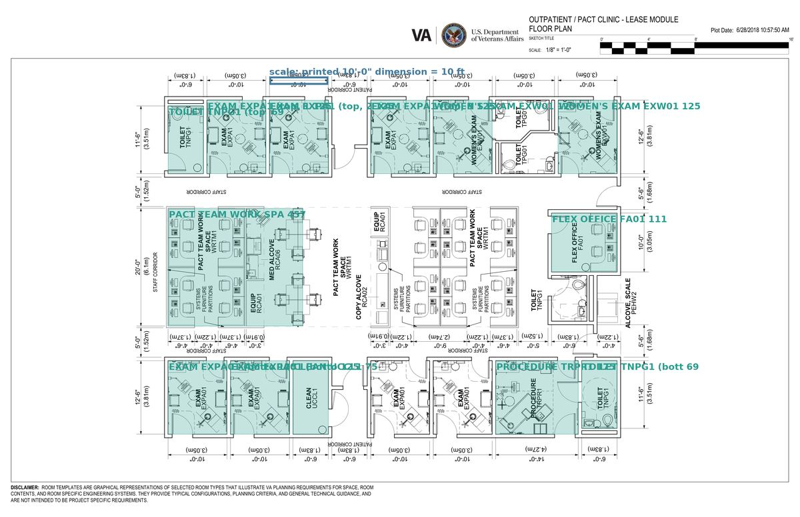

### Answer key

Scale: 21.60 px/ft. a printed 10'-0" dimension on the top dimension string measures 216 px between its extension lines, so 216/10 = 21.6 px per ft. Two independent checks give the same number: a 12'-6" room depth measures 270 px (21.6) and the printed 20'-0" on the left string measures 432 px (21.6). The 0-16 ft graphic bar printed in the corner gives 43.3 px per ft - exactly 2x too much - and must not be used.

| scale reference | feet | px in the key | px/ft | used for the take-off | note |
|---|---|---|---|---|---|
| printed 10'-0" dimension | 10 | 216 | 21.60 | yes | Box it from extension line to extension line (arrowhead to arrowhead). |

| # | label | type | category | printed size | true sq ft | in the take-off | note |
|---|---|---|---|---|---|---|---|
| 1 | TOILET TNPG1 (top left) | bathroom | room | 6'-0" x 11'-6" | 69.4 | yes |  |
| 2 | EXAM EXPA1 (top, 1st) | other | room | 10'-0" x 12'-6" | 125.0 | yes |  |
| 3 | EXAM EXPA1 (top, 2nd) | other | room | 10'-0" x 12'-6" | 125.0 | yes |  |
| 4 | EXAM EXPA1 (top, 3rd) | other | room | 10'-0" x 12'-6" | 125.0 | yes |  |
| 5 | WOMEN'S EXAM EXW01 (top, left) | other | room | 10'-0" x 12'-6" | 125.0 | yes |  |
| 6 | WOMEN'S EXAM EXW01 (top, right) | other | room | 10'-0" x 12'-6" | 125.0 | yes |  |
| 7 | EXAM EXPA01 (bottom, 1st) | other | room | 10'-0" x 12'-6" | 125.0 | yes |  |
| 8 | EXAM EXPA01 (bottom, 2nd) | other | room | 10'-0" x 12'-6" | 125.0 | yes |  |
| 9 | CLEAN UCCL1 | other | room | 6'-0" x 12'-6" | 75.2 | yes | almost empty: the easiest room on the sheet |
| 10 | PROCEDURE TRPR1 | other | room | 14'-0" x 12'-6" | 175.3 | yes | the most furniture of any room here; expect the model to read low |
| 11 | TOILET TNPG1 (bottom right) | bathroom | room | 6'-0" x 11'-6" | 69.4 | yes |  |
| 12 | FLEX OFFICE FA01 | other | room | None | 111.1 | yes | only the 10'-0" depth is printed; the width is read off the drawing |
| 13 | PACT TEAM WORK SPACE (left) | other | room | None | 457.4 | yes | OPEN PLAN: this bay has no wall on its corridor side, so the answer depends on where you draw the box. Three careful box |

- 13 rooms in the take-off, 1,833 sq ft together (1,833 sq ft indoors).

Tasks in the key:

1. Box the printed 10'-0" dimension on the top dimension string, arrowhead to arrowhead (label: scale: printed 10'-0" dimension).
2. Box at least six rooms (label: room). Their measured area is net floor area: the model cuts the furniture out of the mask, so expect to read about 10 % low in a furnished room and closer in an empty one.

### What SAM 3 measures (boxes taken from the key, each side moved by a few percent)

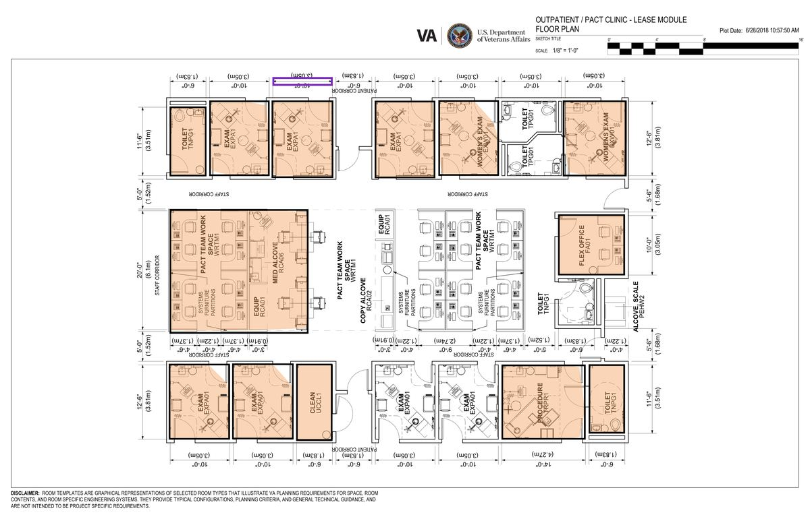

| scale box | px | px/ft | vs the key |
|---|---|---|---|
| printed 10'-0" dimension | 219 | 21.86 | +1.2 % |
Scale used: 21.86 px/ft.

| # | room (key) | measured sq ft | true sq ft | error | note |
|---|---|---|---|---|---|
| 1 | TOILET TNPG1 (top left) | 68.9 | 69 | -1 % |  |
| 2 | EXAM EXPA1 (top, 1st) | 117.2 | 125 | -6 % |  |
| 3 | EXAM EXPA1 (top, 2nd) | 127.3 | 125 | +2 % |  |
| 4 | EXAM EXPA1 (top, 3rd) | 126.3 | 125 | +1 % |  |
| 5 | WOMEN'S EXAM EXW01 (top, left) | 113.2 | 125 | -9 % |  |
| 6 | WOMEN'S EXAM EXW01 (top, right) | 124.2 | 125 | -1 % |  |
| 7 | EXAM EXPA01 (bottom, 1st) | 119.6 | 125 | -4 % |  |
| 8 | EXAM EXPA01 (bottom, 2nd) | 117.0 | 125 | -6 % |  |
| 9 | CLEAN UCCL1 | 73.4 | 75 | -2 % |  |
| 10 | PROCEDURE TRPR1 | 165.2 | 175 | -6 % |  |
| 11 | TOILET TNPG1 (bottom right) | 66.3 | 69 | -4 % |  |
| 12 | FLEX OFFICE FA01 | 109.9 | 111 | -1 % |  |
| 13 | PACT TEAM WORK SPACE (left) | 461.3 | 457 | +1 % |  |
13 rooms: median error 2.4 %, worst 9 %.

### What phrases find (the phrase cells 2b, 3b and 4b, confidence 0.3)

| phrase | regions | scored against (the key category the regions match best) | result |
|---|---|---|---|
| room | 13 | room | 10/13 found, 3 extra; areas median 7 %, worst 58 % |
| door | 0 | room | 0/13 found, 0 extra |
| curved line | 12 | room | 0/13 found, 12 extra |

## va_ceiling - VA outpatient clinic, lease module: reflected ceiling plan (light fixture count)

*electrical.* Outpatient / PACT Clinic, lease module (CBOC-L.pdf), VA Technical Information Library room templates. US Department of Veterans Affairs, Office of Construction & Facilities Management (2018), Public domain (work of the US federal government). https://www.cfm.va.gov/til/rTemplate/documents/CBOC-L.pdf

**The answer key drawn on the sheet** (areas filled with their true sq ft, scale references in blue, every counted symbol in purple):

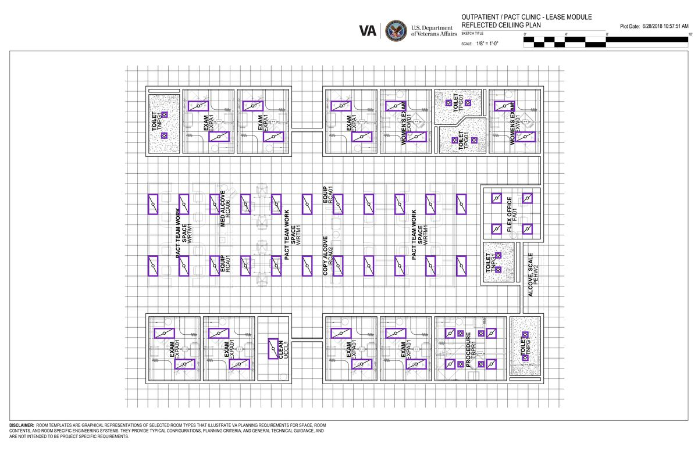

### Answer key

Scale: 21.63 px/ft. there is NO printed dimension on this sheet, so use a length you already know: the acoustic ceiling grid is a 2 ft x 2 ft grid. Ten grid cells in the clear band above the building measure 432.5 px, so 432.5 / 20 ft = 21.63 px per ft. Cross-check: the floor plan of the same module (va_floor) has a printed 10'-0" dimension that gives 21.6 px per ft, 0.1 % apart. The 0-16 ft graphic bar in the corner gives 43.3 px per ft - exactly 2x too much - and must not be used.

| scale reference | feet | px in the key | px/ft | used for the take-off | note |
|---|---|---|---|---|---|

| counted from one example | how many on the sheet | confidence the key suggests | tip |
|---|---|---|---|
| 2x4 light fixture | 41 | 0.40 | Pick a horizontal fixture as your example; a rotated one loses about 40 % of the count and starts returning the stipple-hatched toilet ceilings. The size filter |
| 2x2 light fixture | 8 | 0.40 | Same size filter, the other way round: without it, one 2x2 example returns all 49 fixtures on the sheet. |
| recessed light | 14 | 0.50 | The cleanest count on the whole sheet. The stipple hatching in the toilet rooms does not bother it, so any of the fourteen works as the example. |

Tasks in the key:

1. Box ONE 2x4 light fixture - a horizontal one, in a clear part of the ceiling - with the label 'example: 2x4 light fixture' and SAM 3 counts them all.
2. Do the same for the 2x2 light fixtures (label: example: 2x2 light fixture) and for the small round recessed lights (label: example: recessed light).
3. There are no air diffusers, no return registers and no sprinkler heads anywhere on this sheet. Check the legend before you go looking for them.

### What SAM 3 measures (boxes taken from the key, each side moved by a few percent)

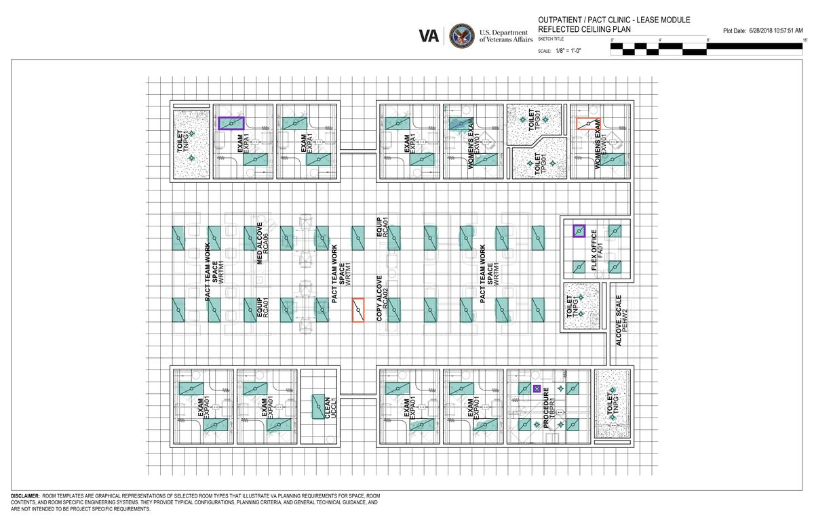

| scale box | px | px/ft | vs the key |
|---|---|---|---|
Scale used: 21.63 px/ft.

| one example box of | confidence | regions returned | found / on the sheet | missed | extra |
|---|---|---|---|---|---|
| 2x4 light fixture | 0.40 | 39 | 39/41 | 2 | 0 |
| 2x2 light fixture | 0.40 | 9 | 8/8 | 0 | 1 |
| recessed light | 0.50 | 14 | 14/14 | 0 | 0 |

### What phrases find (the phrase cells 2b, 3b and 4b, confidence 0.3)

| phrase | regions | scored against (the key category the regions match best) | result |
|---|---|---|---|
| light fixture | 0 | 2x4 light fixture | 0/41 found, 0 extra |
| diffuser | 0 | 2x4 light fixture | 0/41 found, 0 extra |
| rectangle | 31 | 2x4 light fixture | 7/41 found, 24 extra |
| rectangle with a diagonal line | 0 | 2x4 light fixture | 0/41 found, 0 extra |
| small circle | 45 | 2x4 light fixture | 0/41 found, 45 extra |
| square | 0 | 2x4 light fixture | 0/41 found, 0 extra |

## test_fp - Foundation plan: 12 ft square spread footings around an equipment pit

*structural.* Foundation plan, example image 1 (test_fp.png), cropped to the two interior footing rows. Course example drawing (GitHub repository Haolan-Zhang/SAM_Example_Image), Provided for this course. https://github.com/Haolan-Zhang/SAM_Example_Image

**The answer key drawn on the sheet** (areas filled with their true sq ft, scale references in blue, every counted symbol in purple):

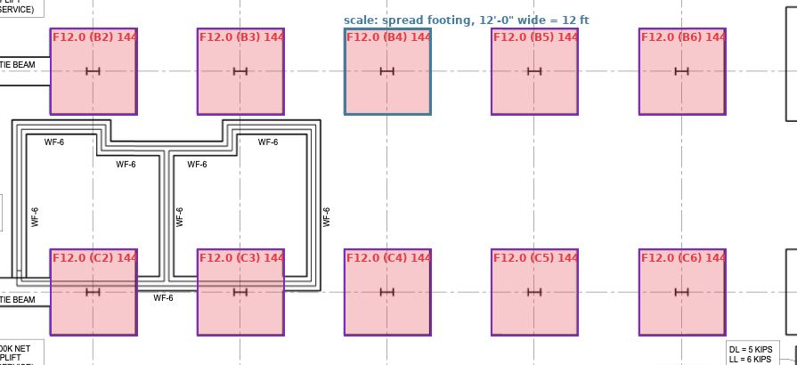

### Answer key

Scale: 8.17 px/ft. you are told that the square spread footings on this plan are marked F12.0, i.e. 12'-0" x 12'-0". Each one measures 98 px across, so 98/12 = 8.17 px per ft. There is NO printed dimension and NO scale bar anywhere on this sheet, so there is no second, independent route - this is the one drawing in the set where you cannot check the scale against anything. All ten footings measure 98 +/- 1 px, which tells you the drawing is consistent, not what its scale is. (If you assume the footing spacing of 165.5 px is a round 20'-0" bay you get 8.28 px per ft, 1.3 % away - but that rests on a guess, not on the sheet.)

| scale reference | feet | px in the key | px/ft | used for the take-off | note |
|---|---|---|---|---|---|
| spread footing, 12'-0" wide | 12 | 98 | 8.17 | yes | Box one footing outside edge to outside edge. Use an isolated one, not one with a tie beam running into it. |

| # | label | type | category | printed size | true sq ft | in the take-off | note |
|---|---|---|---|---|---|---|---|
| 1 | F12.0 (B2) | footing | footing | 12'-0" x 12'-0" | 144.0 | yes | a tie beam runs into this footing; the mask is eaten a little where the beam joins |
| 2 | F12.0 (B3) | footing | footing | 12'-0" x 12'-0" | 144.0 | yes |  |
| 3 | F12.0 (B4) | footing | footing | 12'-0" x 12'-0" | 144.0 | yes |  |
| 4 | F12.0 (B5) | footing | footing | 12'-0" x 12'-0" | 144.0 | yes |  |
| 5 | F12.0 (B6) | footing | footing | 12'-0" x 12'-0" | 144.0 | yes |  |
| 6 | F12.0 (C2) | footing | footing | 12'-0" x 12'-0" | 144.0 | yes | a tie beam runs into this footing; the mask is eaten a little where the beam joins |
| 7 | F12.0 (C3) | footing | footing | 12'-0" x 12'-0" | 144.0 | yes | a tie beam runs into this footing; the mask is eaten a little where the beam joins |
| 8 | F12.0 (C4) | footing | footing | 12'-0" x 12'-0" | 144.0 | yes |  |
| 9 | F12.0 (C5) | footing | footing | 12'-0" x 12'-0" | 144.0 | yes |  |
| 10 | F12.0 (C6) | footing | footing | 12'-0" x 12'-0" | 144.0 | yes |  |

- 10 footings in the take-off, 1,440 sq ft together.

| counted from one example | how many on the sheet | confidence the key suggests | tip |
|---|---|---|---|
| footing | 10 | 0.30 | Use an isolated footing as your example, never one with a tie beam running into it: on the full sheet a chained example produced 33 things that were not footing |

Tasks in the key:

1. This sheet prints no dimension and carries no scale bar. You are told instead: every square footing here is marked F12.0, which means 12'-0" x 12'-0".
2. Box several footings (label: footing), outside edge to outside edge, and make the FIRST one an isolated footing (not one with a tie beam running into it). Your first footing box does three jobs: it sets the scale (12'-0" wide), it is measured like the others (144 sq ft each), and it is the example SAM 3 uses to count all the footings. There are 10.
3. The thing in the middle is a pair of equipment pits, not a footing. No size is printed for it anywhere, so there is no area task on it.

### What SAM 3 measures (boxes taken from the key, each side moved by a few percent)

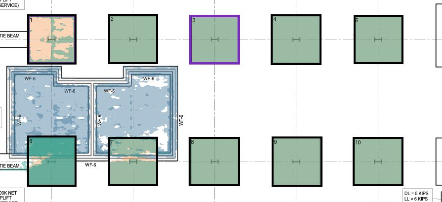

| scale box | px | px/ft | vs the key |
|---|---|---|---|
| spread footing, 12'-0" wide | 102 | 8.54 | +4.5 % |
Scale used: 8.54 px/ft.

| # | footing (key) | measured sq ft | true sq ft | error | note |
|---|---|---|---|---|---|
| 1 | F12.0 (B2) | 126.3 | 144 | -12 % | the mask fills 92 % of your box - look at the outline: if it is a rounded copy of your box rather than the thi |
| 2 | F12.0 (B3) | 127.6 | 144 | -11 % | the mask fills 92 % of your box - look at the outline: if it is a rounded copy of your box rather than the thi |
| 3 | F12.0 (B4) | 133.1 | 144 | -8 % | the mask fills 99 % of your box - look at the outline: if it is a rounded copy of your box rather than the thi |
| 4 | F12.0 (B5) | 129.9 | 144 | -10 % | the mask fills 91 % of your box - look at the outline: if it is a rounded copy of your box rather than the thi |
| 5 | F12.0 (B6) | 133.8 | 144 | -7 % | the mask fills 99 % of your box - look at the outline: if it is a rounded copy of your box rather than the thi |
| 6 | F12.0 (C2) | 124.7 | 144 | -13 % | the mask fills 90 % of your box - look at the outline: if it is a rounded copy of your box rather than the thi |
| 7 | F12.0 (C3) | 121.6 | 144 | -16 % |  |
| 8 | F12.0 (C4) | 128.4 | 144 | -11 % | the mask fills 92 % of your box - look at the outline: if it is a rounded copy of your box rather than the thi |
| 9 | F12.0 (C5) | 129.7 | 144 | -10 % | the mask fills 92 % of your box - look at the outline: if it is a rounded copy of your box rather than the thi |
| 10 | F12.0 (C6) | 128.9 | 144 | -11 % | the mask fills 93 % of your box - look at the outline: if it is a rounded copy of your box rather than the thi |
10 footings: median error 10.7 %, worst 16 %.

| one example box of | confidence | regions returned | found / on the sheet | missed | extra |
|---|---|---|---|---|---|
| footing | 0.30 | 17 | 10/10 | 0 | 4 |

### What phrases find (the phrase cells 2b, 3b and 4b, confidence 0.3)

| phrase | regions | scored against (the key category the regions match best) | result |
|---|---|---|---|
| footing | 0 | footing | 0/10 found, 0 extra |
| foundation | 0 | footing | 0/10 found, 0 extra |
| square | 15 | footing | 10/10 found, 5 extra; areas median 2 %, worst 48 % |
| hatched square | 0 | footing | 0/10 found, 0 extra |
| rectangle | 23 | footing | 10/10 found, 9 extra; areas median 1 %, worst 49 % |

## test_fp_2 - Foundation plan with square spread footings and an elevator shaft

*structural.* Foundation plan, example image 2 (test_fp_2.png). Course example drawing (GitHub repository Haolan-Zhang/SAM_Example_Image), Provided for this course. https://github.com/Haolan-Zhang/SAM_Example_Image

**The answer key drawn on the sheet** (areas filled with their true sq ft, scale references in blue, every counted symbol in purple):

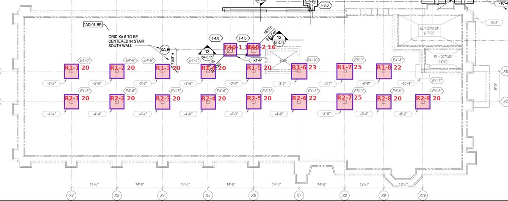

### Answer key

Scale: 15.29 px/ft. the printed 14'-0" bay between grid lines X2 and X3 on the bottom dimension string measures 214 px, so 214/14 = 15.29 px per ft (the next two 14'-0" bays measure 214 px as well). Second route: the heavy black F4.0 footing is 4'-0" wide and measures 63 px outside to outside, which gives 15.75 px per ft - 3 % higher.

| scale reference | feet | px in the key | px/ft | used for the take-off | note |
|---|---|---|---|---|---|
| printed 14'-0" bay X2-X3 | 14 | 214 | 15.29 | yes | The longest printed dimension you can reach is the best ruler on any sheet. |
| F4.0 footing, 4'-0" wide | 4 | 63 | 15.75 | check only | A 63 px symbol is a short ruler. Read outside-to-outside it gives 15.75 px/ft (3 % above the bay); read inside-to-inside its heavy 3 px line it gives 14.25 px/ft (7 % below). A 3 % scale error is a 6 % area error, and a 7 % one is 14 %. |

| # | label | type | category | printed size | true sq ft | in the take-off | note |
|---|---|---|---|---|---|---|---|
| 1 | R1-1 | footing | footing | E4'-6" | 20.2 | yes |  |
| 2 | R1-2 | footing | footing | E4'-6" | 20.2 | yes |  |
| 3 | R1-3 | footing | footing | E4'-6" | 20.2 | yes |  |
| 4 | R1-4 | footing | footing | E4'-6" | 20.2 | yes |  |
| 5 | R1-5 | footing | footing | E4'-6" | 20.2 | yes | the hexagon mark for this footing is crowded out by the elevator detail; it is drawn 70 px wide, the same as the E4'-6"  |
| 6 | R1-6 | footing | footing | E4'-10" | 23.4 | yes |  |
| 7 | R1-7 | footing | footing | E5'-0" | 25.0 | yes |  |
| 8 | R1-8 | footing | footing | E4'-8" | 21.8 | yes |  |
| 9 | R2-1 | footing | footing | E4'-6" | 20.2 | yes |  |
| 10 | R2-2 | footing | footing | E4'-6" | 20.2 | yes |  |
| 11 | R2-3 | footing | footing | E4'-6" | 20.2 | yes |  |
| 12 | R2-4 | footing | footing | E4'-6" | 20.2 | yes |  |
| 13 | R2-5 | footing | footing | E4'-6" | 20.2 | yes |  |
| 14 | R2-6 | footing | footing | E4'-8" | 21.8 | yes |  |
| 15 | R2-7 | footing | footing | E5'-0" | 25.0 | yes |  |
| 16 | R2-8 | footing | footing | E4'-6" | 20.2 | yes |  |
| 17 | R2-9 | footing | footing | E4'-6" | 20.2 | yes |  |
| 18 | F40-1 | footing | footing | F4.0 | 16.0 | yes |  |
| 19 | F40-2 | footing | footing | F4.0 | 16.0 | yes |  |
| 20 | elevator shaft opening | pit | pit | None | 48.2 | yes | no printed size: this is the drawn opening measured with the sheet scale, so treat it as +/-5 %. |

- 19 footings in the take-off, 392 sq ft together.
- 1 pit in the take-off, 48 sq ft together.

| counted from one example | how many on the sheet | confidence the key suggests | tip |
|---|---|---|---|
| footing | 19 | 0.40 | Either a light grey footing or one of the two heavy black F4.0 ones works as the example - the model does not care about the line weight. The thin strip along t |

Tasks in the key:

1. Box the printed 14'-0" bay X2-X3 on the bottom dimension string, tick to tick (label: scale: printed 14'-0" bay X2-X3).
2. Box one heavy black F4.0 footing as a second scale (label: scale: F4.0 footing, 4'-0" wide) - it is 4'-0" wide - and compare the two answers.
3. Box several footings (label: footing). The hexagon next to each one gives its size: E4'-6", E4'-8", E4'-10", E5'-0", and F4.0 for the two heavy black ones. Your first footing box is also the example SAM 3 uses to count them all: make it a grey one. There are 19, 17 grey ones and the 2 heavy black F4.0.
4. Box the elevator shaft opening (label: pit).

### What SAM 3 measures (boxes taken from the key, each side moved by a few percent)

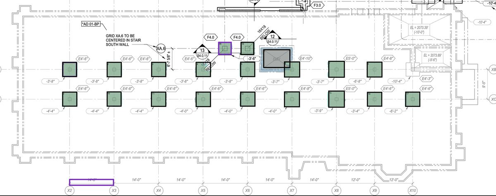

| scale box | px | px/ft | vs the key |
|---|---|---|---|
| printed 14'-0" bay X2-X3 | 217 | 15.47 | +1.2 % |
| F4.0 footing, 4'-0" wide | 64 | 16.07 | +2.0 % |
Scale used: 15.47 px/ft.

| # | footing (key) | measured sq ft | true sq ft | error | note |
|---|---|---|---|---|---|
| 1 | R1-1 | 20.1 | 20 | -1 % | the mask fills 92 % of your box - look at the outline: if it is a rounded copy of your box rather than the thi |
| 2 | R1-2 | 20.4 | 20 | +1 % | the mask fills 92 % of your box - look at the outline: if it is a rounded copy of your box rather than the thi |
| 3 | R1-3 | 20.5 | 20 | +1 % | the mask fills 95 % of your box - look at the outline: if it is a rounded copy of your box rather than the thi |
| 4 | R1-4 | 15.5 | 20 | -23 % |  |
| 5 | R1-5 | 20.3 | 20 | +0 % | the mask fills 93 % of your box - look at the outline: if it is a rounded copy of your box rather than the thi |
| 6 | R1-6 | 23.1 | 23 | -1 % | the mask fills 92 % of your box - look at the outline: if it is a rounded copy of your box rather than the thi |
| 7 | R1-7 | 24.6 | 25 | -2 % | the mask fills 93 % of your box - look at the outline: if it is a rounded copy of your box rather than the thi |
| 8 | R1-8 | 21.9 | 22 | +0 % | the mask fills 92 % of your box - look at the outline: if it is a rounded copy of your box rather than the thi |
| 9 | R2-1 | 20.3 | 20 | +0 % | the mask fills 94 % of your box - look at the outline: if it is a rounded copy of your box rather than the thi |
| 10 | R2-2 | 20.4 | 20 | +1 % | the mask fills 95 % of your box - look at the outline: if it is a rounded copy of your box rather than the thi |
| 11 | R2-3 | 20.8 | 20 | +3 % | the mask fills 94 % of your box - look at the outline: if it is a rounded copy of your box rather than the thi |
| 12 | R2-4 | 21.0 | 20 | +4 % | the mask fills 93 % of your box - look at the outline: if it is a rounded copy of your box rather than the thi |
| 13 | R2-5 | 20.5 | 20 | +1 % | the mask fills 92 % of your box - look at the outline: if it is a rounded copy of your box rather than the thi |
| 14 | R2-6 | 22.0 | 22 | +1 % | the mask fills 90 % of your box - look at the outline: if it is a rounded copy of your box rather than the thi |
| 15 | R2-7 | 25.2 | 25 | +1 % | the mask fills 93 % of your box - look at the outline: if it is a rounded copy of your box rather than the thi |
| 16 | R2-8 | 20.3 | 20 | +0 % | the mask fills 95 % of your box - look at the outline: if it is a rounded copy of your box rather than the thi |
| 17 | R2-9 | 20.5 | 20 | +1 % | the mask fills 94 % of your box - look at the outline: if it is a rounded copy of your box rather than the thi |
| 18 | F40-1 | 16.5 | 16 | +3 % | the mask fills 96 % of your box - look at the outline: if it is a rounded copy of your box rather than the thi |
| 19 | F40-2 | 16.7 | 16 | +4 % | the mask fills 98 % of your box - look at the outline: if it is a rounded copy of your box rather than the thi |
19 footings: median error 1.0 %, worst 23 %.

| # | pit (key) | measured sq ft | true sq ft | error | note |
|---|---|---|---|---|---|
| 1 | elevator shaft opening | 50.1 | 48 | +4 % | the mask fills 102 % of your box - look at the outline: if it is a rounded copy of your box rather than the th |
1 pit: median error 3.9 %, worst 4 %.

| one example box of | confidence | regions returned | found / on the sheet | missed | extra |
|---|---|---|---|---|---|
| footing | 0.40 | 20 | 19/19 | 0 | 1 |

### What phrases find (the phrase cells 2b, 3b and 4b, confidence 0.3)

| phrase | regions | scored against (the key category the regions match best) | result |
|---|---|---|---|
| footing | 0 | footing | 0/19 found, 0 extra |
| square | 42 | footing | 19/19 found, 23 extra; areas median 10 %, worst 17 % |
| hatched square | 0 | footing | 0/19 found, 0 extra |
| rectangle | 25 | footing | 19/19 found, 6 extra; areas median 11 %, worst 15 % |

## uscg_motorpool - USCG motor pool shop building: foundation plan with footing schedule

*structural.* Motor Pool Facility, Support Center New York, Shop Building (Building 928): structural foundation plan, details and notes, sheet S-1, 20 June 1984. U.S. Coast Guard, 3rd District Governors Island NY, Civil Engineering; drawn by Gonchor & Sput, Architects & Planners, Public domain (work of the US federal government). https://commons.wikimedia.org/wiki/File:Building_928_Structural_Foundation_Plan,_Details_and_Notes_Shop_Building,_June_20,_1984_-_DPLA_-_2938a6cfb0663504470f4b44fe7ae27e.tiff

**The answer key drawn on the sheet** (areas filled with their true sq ft, scale references in blue, every counted symbol in purple):

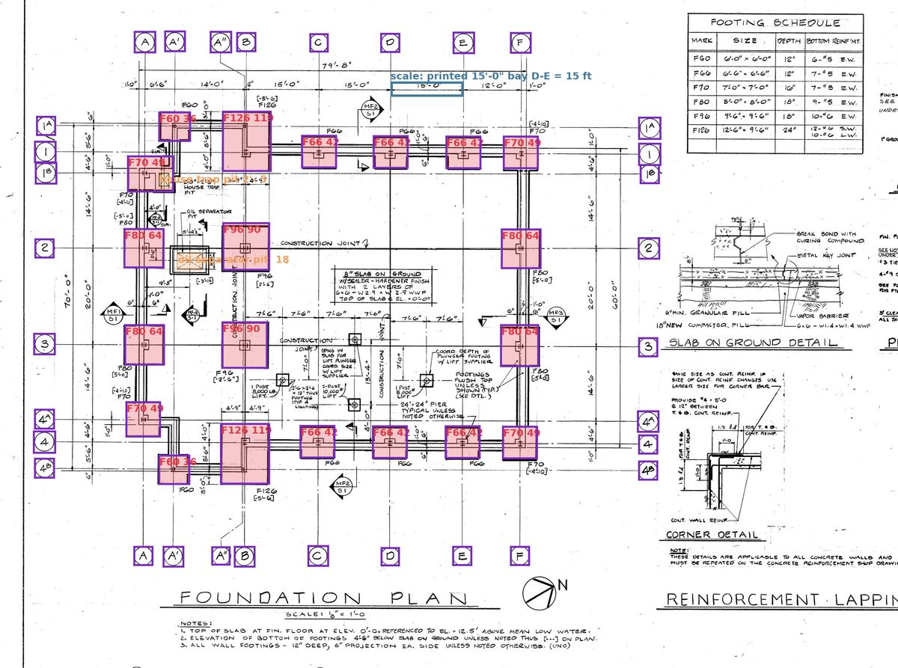

### Answer key

Scale: 12.27 px/ft. the printed 15'-0" bay D-E on the top dimension string measures 184 px, so 184/15 = 12.27 px per ft. Cross-check with the longest printed dimension, the 79'-8" overall: 979 px / 79.67 ft = 12.29 px per ft, 0.2 % apart. This is a hand-inked 1984 sheet, so nominally identical bays are not identical on paper: the other two 15'-0" bays measure 186 px (12.40) and 181 px (12.07), a 1.4 % wobble either side.

| scale reference | feet | px in the key | px/ft | used for the take-off | note |
|---|---|---|---|---|---|
| printed 15'-0" bay D-E | 15 | 184 | 12.27 | yes |  |
| printed 79'-8" overall dimension | 79.667 | 979 | 12.29 | check only | The longer ruler is the safer one. It agrees with the single bay to 0.2 % here, but on a hand-inked sheet a single bay can be 1.5 % out on its own. |

| # | label | type | category | printed size | true sq ft | in the take-off | note |
|---|---|---|---|---|---|---|---|
| 1 | F60 | footing | footing | 6'-0" x 6'-0" | 36.0 | yes |  |
| 2 | F126 | footing | footing | 12'-6" x 9'-6" | 118.8 | yes |  |
| 3 | F66 | footing | footing | 6'-6" x 6'-6" | 42.2 | yes |  |
| 4 | F66 | footing | footing | 6'-6" x 6'-6" | 42.2 | yes |  |
| 5 | F66 | footing | footing | 6'-6" x 6'-6" | 42.2 | yes |  |
| 6 | F70 | footing | footing | 7'-0" x 7'-0" | 49.0 | yes |  |
| 7 | F70 | footing | footing | 7'-0" x 7'-0" | 49.0 | yes |  |
| 8 | F80 | footing | footing | 8'-0" x 8'-0" | 64.0 | yes |  |
| 9 | F80 | footing | footing | 8'-0" x 8'-0" | 64.0 | yes |  |
| 10 | F70 | footing | footing | 7'-0" x 7'-0" | 49.0 | yes |  |
| 11 | F80 | footing | footing | 8'-0" x 8'-0" | 64.0 | yes |  |
| 12 | F80 | footing | footing | 8'-0" x 8'-0" | 64.0 | yes |  |
| 13 | F96 | footing | footing | 9'-6" x 9'-6" | 90.2 | yes |  |
| 14 | F96 | footing | footing | 9'-6" x 9'-6" | 90.2 | yes |  |
| 15 | F60 | footing | footing | 6'-0" x 6'-0" | 36.0 | yes |  |
| 16 | F126 | footing | footing | 12'-6" x 9'-6" | 118.8 | yes |  |
| 17 | F66 | footing | footing | 6'-6" x 6'-6" | 42.2 | yes |  |
| 18 | F66 | footing | footing | 6'-6" x 6'-6" | 42.2 | yes |  |
| 19 | F66 | footing | footing | 6'-6" x 6'-6" | 42.2 | yes |  |
| 20 | F70 | footing | footing | 7'-0" x 7'-0" | 49.0 | yes |  |
| 21 | house trap pit 2'-0"x2'-6" | pit | pit | 2'-0" x 2'-6" | 5.0 | yes | too small for the model on this sheet: about 40 px across, where SAM 3 needs roughly 60 px. The number you get back is t |
| 22 | oil separator pit 5'-4 1/2"x3'-4" | pit | pit | 5'-4 1/2" x 3'-4" | 17.9 | yes | too small for the model on this sheet: about 40 px across, where SAM 3 needs roughly 60 px. The number you get back is t |

- 20 footings in the take-off, 1,196 sq ft together.
- 2 pits in the take-off, 23 sq ft together.

| counted from one example | how many on the sheet | confidence the key suggests | tip |
|---|---|---|---|
| footing | 20 | 0.30 | Use one of the square pads that bulge out of the wall footing (an F66) as the example. Keep the confidence at 0.3 on this hand-inked scan: at 0.4 it starts drop |
| grid bubble | 32 | 0.50 | Bubbles are circles and the model is good at circles: 0.5 keeps all 32 and removes most of the other round marks. The word 'grid bubble' typed as a phrase retur |

Tasks in the key:

1. Box the printed 15'-0" bay D-E on the top dimension string (label: scale: printed 15'-0" bay D-E), then the 79'-8" overall as a check.
2. Read the FOOTING SCHEDULE at the top right: F60 is 6'-0" square, F66 6'-6", F70 7'-0", F80 8'-0", F96 9'-6" and F126 is 12'-6" x 9'-6".
3. Box several of the scheduled footings (label: footing) and compare your measured area with the schedule size.
4. The two X-crossed pits (label: pit) are in the key as well, but they are only about 40 px across on this sheet. Measure one and watch what the warning says.
5. Your first footing box is also the example SAM 3 uses to count all the footings (there are 20). The grid bubbles are counted the same way from ONE box labelled 'example: grid bubble' (there are 32).

### What SAM 3 measures (boxes taken from the key, each side moved by a few percent)

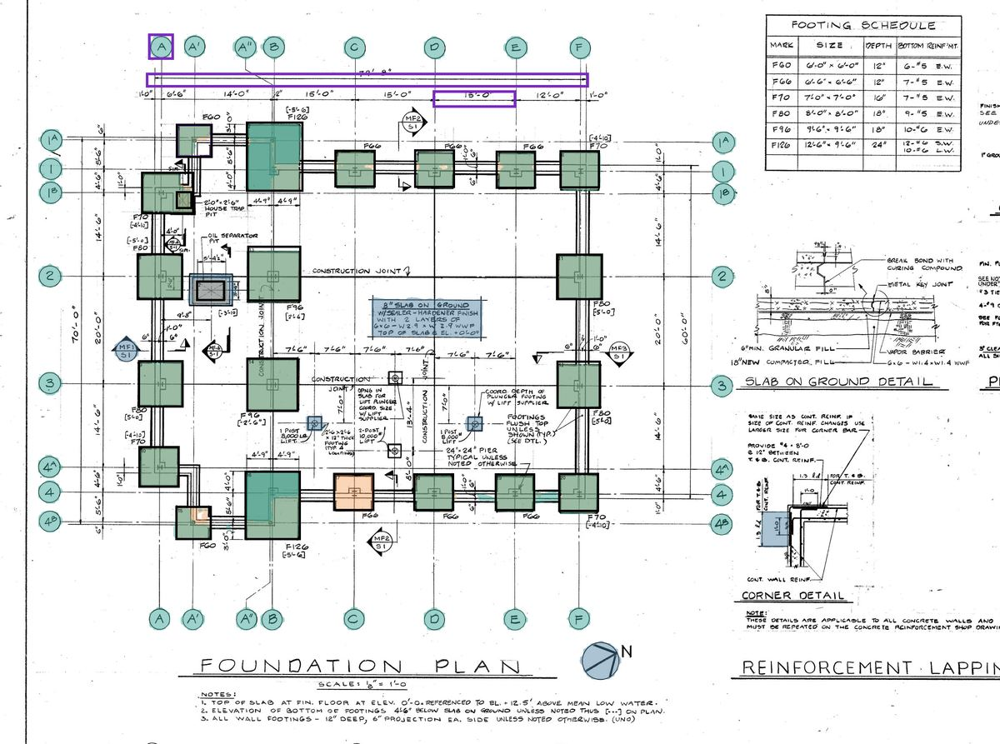

| scale box | px | px/ft | vs the key |
|---|---|---|---|
| printed 15'-0" bay D-E | 189 | 12.58 | +2.6 % |
| printed 79'-8" overall dimension | 1005 | 12.61 | +2.6 % |
Scale used: 12.58 px/ft.

| # | footing (key) | measured sq ft | true sq ft | error | note |
|---|---|---|---|---|---|
| 1 | F60 | 25.2 | 36 | -30 % |  |
| 2 | F126 | 112.5 | 119 | -5 % |  |
| 3 | F66 | 44.9 | 42 | +6 % | the mask fills 91 % of your box - look at the outline: if it is a rounded copy of your box rather than the thi |
| 4 | F66 | 42.5 | 42 | +1 % |  |
| 5 | F66 | 42.7 | 42 | +1 % |  |
| 6 | F70 | 47.9 | 49 | -2 % | the mask fills 98 % of your box - look at the outline: if it is a rounded copy of your box rather than the thi |
| 7 | F70 | 59.5 | 49 | +22 % |  |
| 8 | F80 | 61.1 | 64 | -5 % |  |
| 9 | F80 | 62.4 | 64 | -2 % | the mask fills 90 % of your box - look at the outline: if it is a rounded copy of your box rather than the thi |
| 10 | F70 | 47.1 | 49 | -4 % |  |
| 11 | F80 | 60.6 | 64 | -5 % |  |
| 12 | F80 | 60.5 | 64 | -5 % |  |
| 13 | F96 | 86.7 | 90 | -4 % |  |
| 14 | F96 | 87.6 | 90 | -3 % | the mask fills 96 % of your box - look at the outline: if it is a rounded copy of your box rather than the thi |
| 15 | F60 | 33.3 | 36 | -8 % |  |
| 16 | F126 | 115.7 | 119 | -3 % | the mask fills 92 % of your box - look at the outline: if it is a rounded copy of your box rather than the thi |
| 17 | F66 | 45.5 | 42 | +8 % | the mask fills 90 % of your box - look at the outline: if it is a rounded copy of your box rather than the thi |
| 18 | F66 | 44.1 | 42 | +4 % |  |
| 19 | F66 | 45.2 | 42 | +7 % | the mask fills 93 % of your box - look at the outline: if it is a rounded copy of your box rather than the thi |
| 20 | F70 | 47.4 | 49 | -3 % | the mask fills 94 % of your box - look at the outline: if it is a rounded copy of your box rather than the thi |
20 footings: median error 4.5 %, worst 30 %.

| # | pit (key) | measured sq ft | true sq ft | error | note |
|---|---|---|---|---|---|
| 1 | house trap pit 2'-0"x2'-6" | 10.2 | 5 | +104 % | your box is only 37 px across, and under about 60 px a symbol is too small for the model on this sheet: the nu |
| 2 | oil separator pit 5'-4 1/2"x3'-4" | 28.7 | 18 | +60 % | your box is only 46 px across, and under about 60 px a symbol is too small for the model on this sheet: the nu |
2 pits: median error 82.2 %, worst 104 %.

| one example box of | confidence | regions returned | found / on the sheet | missed | extra |
|---|---|---|---|---|---|
| footing | 0.30 | 27 | 19/20 | 1 | 5 |
| grid bubble | 0.50 | 34 | 32/32 | 0 | 2 |

### What phrases find (the phrase cells 2b, 3b and 4b, confidence 0.3)

| phrase | regions | scored against (the key category the regions match best) | result |
|---|---|---|---|
| footing | 0 | footing | 0/20 found, 0 extra |
| square | 19 | footing | 9/20 found, 10 extra; areas median 2 %, worst 6 % |
| rectangle | 11 | footing | 7/20 found, 4 extra; areas median 2 %, worst 6 % |
| circle | 38 | grid bubble | 32/32 found, 6 extra |

## uscg_pile - USCG bowling facility: pile footing plan (counting only)

*structural.* Building 785, Sixteen Lane Bowling Facility, Governors Island: foundation plan, sheet 7 of 11, 19 January 1983. U.S. Coast Guard Support Center New York, Public Works Engineering (traced from International Design Consultants Inc.), Public domain (work of the US federal government). https://commons.wikimedia.org/wiki/File:Building_785_Sixteen_Lane_Bowling_Facility_Foundation_Plan,_January_19,_1983_-_DPLA_-_ec587aa2a393d5917cb73be19a2da195.tiff

**The answer key drawn on the sheet** (areas filled with their true sq ft, scale references in blue, every counted symbol in purple):

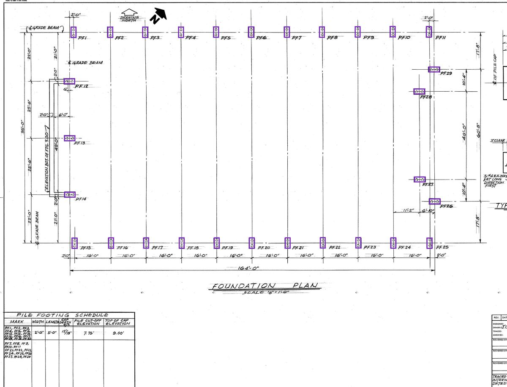

### Answer key

Scale: 10.53 px/ft. the printed 16'-0" bay between pile footings PF20 and PF21 on the bottom dimension string measures 168.5 px, so 168.5/16 = 10.53 px per ft. Cross-check with the 164'-0" overall dimension under it: 1726.5 px / 164 ft = 10.53 px per ft, 0.04 % apart - the best agreement of any sheet in this set.

| scale reference | feet | px in the key | px/ft | used for the take-off | note |
|---|---|---|---|---|---|

| counted from one example | how many on the sheet | confidence the key suggests | tip |
|---|---|---|---|
| pile footing | 29 | 0.30 | The cleanest count in the whole set: every threshold from 0.3 to 0.5 finds all 29. Even a rotated cap works as the example here. Counting works although the cap |

Tasks in the key:

1. Box ONE pile cap with the label 'example: pile footing' and SAM 3 counts them all. There are 29 and they are numbered PF1 to PF29, so you can check yourself.
2. There is no area task on this sheet, on purpose. Each cap is 2'-6" x 5'-0" (read the PILE FOOTING SCHEDULE at the bottom left) and is drawn only 27 x 53 px, well under the ~60 px SAM 3 needs. Every attempt in the feasibility test came out 12 % to 35 % too big, because below that size the mask stops following the drawn rectangle and becomes a rounded copy of the box you drew. Take the 12.5 sq ft from the schedule instead.

### What SAM 3 measures (boxes taken from the key, each side moved by a few percent)

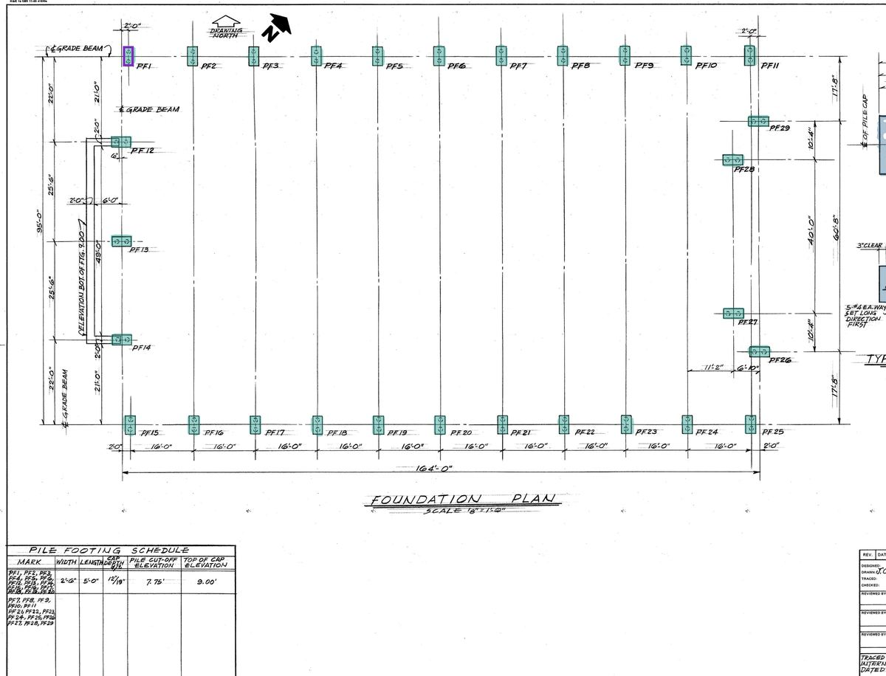

| scale box | px | px/ft | vs the key |
|---|---|---|---|
Scale used: 10.53 px/ft.

| one example box of | confidence | regions returned | found / on the sheet | missed | extra |
|---|---|---|---|---|---|
| pile footing | 0.30 | 31 | 29/29 | 0 | 2 |

### What phrases find (the phrase cells 2b, 3b and 4b, confidence 0.3)

| phrase | regions | scored against (the key category the regions match best) | result |
|---|---|---|---|
| footing | 0 | pile footing | 0/29 found, 0 extra |
| square | 0 | pile footing | 0/29 found, 0 extra |
| rectangle | 37 | pile footing | 29/29 found, 8 extra |
